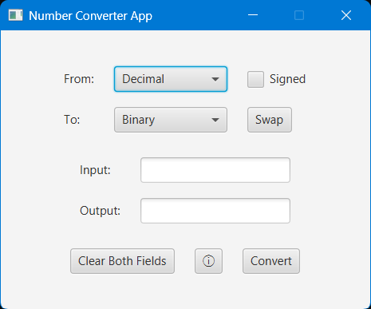
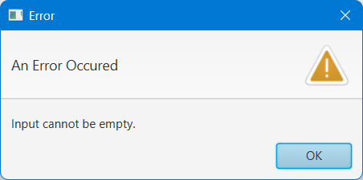
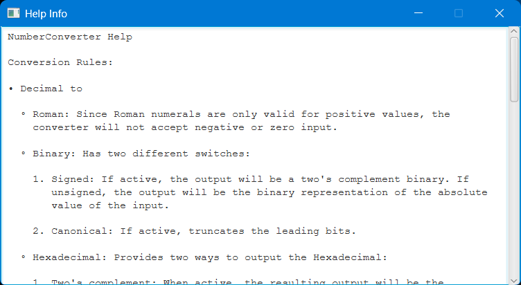

# Number Converter

A JavaFX application that converts between Decimal, Binary, Hexadecimal, and Roman numerals. Uses a Python backend script for conversion logic.

## Features

- Supports 12 conversion options
- Signed and unsigned interpretation for binary and hexadecimal numbers
- Accepts lowercase input for Roman numerals and ignores leading and trailing spaces
- Dynamic dropdown menus that allow for selecting conversion options
- Swap button to reverse conversion modes
- Displays Descriptive error messages in popup windows
- In-app help window
- Uses a JavaFX GUI frontend with a Python backend script

## How it works

The JavaFX GUI records the input value, source form, target form, and other conversion options (such as the signed mode value) and passes them to the Python backend script, invoking it through ProcessBuilder.

The backend script translates the received conversion forms, and based on them, selects the appropriate function from the core functions module and sends the result back to the GUI for display.

## Structure

- `number_conversion_functions.py`: Core conversion functions module
- `backend_script.py`: Python backend script that connects the GUI to the core functions module
- `NumberConverter.java`: JavaFX GUI frontend application
- `Help.txt`: In-app help file

## How to Run

- Download all files mentioned in the [Structure](#structure) section
- Make sure they are all in the same directory
- Make sure Python 3.10+ is installed (necessary for the match-case statements)
- Make sure JavaFX is installed (necessary for compiling the GUI file)
- Compile and run `NumberConverter.java` using JavaFX

## Example

``` text
Roman Numeral: XIV
Decimal Number: 14

Binary Number: 1001
Status: signed
Decimal Number: -7

Hexadecimal Number: BEEF
Binary Number: 1011111011101111

Decimal Number: -1008
Status: signed (two's complement)
Hexadecimal Number: C10

Decimal Number: -1008
Status: unsigned (explicit sign notation)
Hexadecimal Number: -3F0

Roman Numeral: IVX
Error: Invalid Roman numeral
```

## Screenshots

### Main Application



### Error Popup



### Help Info



## Notes

- For a more precise and detailed description of conversion rules, click the in-app info button and refer to the help window, or manually read the `Help.txt` file.
- Some conversion results might differ depending on whether the signed box is checked or not.